# PyTorch Introduction - with examples

This is a brief summary of the 5h [course](https://www.youtube.com/watch?v=c36lUUr864M) from Patrick (YT: [Python Engineer](https://www.youtube.com/channel/UCbXgNpp0jedKWcQiULLbDTA)) about how to use **PyTorch**.

<br>

### Table of Content

| Chapter | Description |
| ------- | ----------- |
| [PyTorch Installation](#pytorch-installation) | How to setup PyTorch locally (the right way incl. vir env) |
| [Tensors Basics](#tensors-basics) | Create tensors and basic operations (Add, Sum etc.) |
| [Autograd](#gradient-optimization-with-autograd) | Calculate the gradients of a tensor |
| [Backpropagation](#backpropagation) | How Backpropagation works in theoretical + small example |
| [Gradient Descent](#gradient-descent) | Implement a Linear Regression and do everything manually as well as with the functionality of PyTorch. Also implement a Linear Regression class from scratch |
| [Linear Regression](#linear-regression) | Implement a Linear Regression completely with PyTorch modules |
| [Logistic Regression](#logistic-regression) | Implement a Logistic Regression completely with PyTorch modules |
| [Datasets & Dataloader](#datasets-and-dataloader) | Shows how you can build your own dataloader with use of the lib datasets |
| [Dataset Transforms](#dataset-transforms) | Shows how to transform you own dataset properly for your needs |
| [Softmax & Cross Entropy](#softmax-and-cross-entropy) | Shows how to transform you own dataset properly for your needs |
| [Activation Functions](#activation-functions) | What are the different activation functions and how to use them in code |


<br>

***

<br>
<br>

# PyTorch Installation [^](#table-of-content)

1) Go to [pytorch.org](www.pytorch.org) and click on **Install**
2) **Configure** your settings, in my case:

    | Settings | Value |
    | - | - |
    | PyTorch Build | Stable (1.10.0) |
    | Your OS | Mac |
    | Package | Conda |
    | Language | Python |
    | Compute Platform | CPU |

    Unfortunally I have no GPU in my Mac, else you can use a specific *CUDA* version. Therefor you have to first download [*CUDA* Toolkit](www.google.de). *Cuda* Toolkit is a dev environment for creating high performance GPU accelerated applications. If you have a NVIDIA GPU in your machine i highly recomment to download the toolkit.

3) Copy the **Run this Command**, in my case `conda install pytorch torchvision torchaudio -c pytorch`
4) Open up the terminal
5) Navigate to a folder of your choice where the project should be located (navigate with `cd` followed by the folder path)
6) Create a virtual environment with *conda*

    ```bash
    conda create --name pytorch-basics python=3.7
    ```

    > Note: ATM **PyTorch** can't work with python 3.8+ so use Python 3.7 instead

   ```bash
    conda activate pytorch-basics
    ```
7) Now paste the installation command from 3) in the terminal, this will install **PyTorch** inside the virtual environment
    ```bash
    conda install pytorch torchvision torchaudio -c pytorch
    ```
8) Verify the **PyTorch** installation by starting Python inside this environment. Therefor start python
    ```bash
    python
    ```
    followed by 
    ```bash
    import torch
    ```
    
    <br>

    > If the installation was *NOT* correct, you would get now a **`ModuleNotFoundError`**. In this case try again to install PyTorch with the command, created in 3). You can also see [this troubleshoot article](https://pytorch.org/get-started/locally/#mac-prerequisites) for further informations. 
    
    **Else you successfull installed **PyTorch****

9) (*optional*) You can also verify if *Cuda* is available 
    ```bash
    import torch
    torch.cuda.is_available()
    ```
    In my case (MacOs) I get False returned.

<br>

***

<br>
<br>

# Tensors Basics [^](#table-of-content)
You can find basic operations with tensors in the script `tensors.py`.

### Topics:
- Create:
    - 1D Vectors
    - 2D Matrix
    - 3D Tensor
    - Custom Tensor (variable size + values)
- dtype
- size
- Operations:
    - Addition of tensors
    - Subtraction of tensors
    - Multiplication of tensors
    - Division of tensors
- Inplace operations
    - Add
    - Subtract
    - Multiply
    - Division
- Slicing
- Reshaping
- Converting numpy <-> tensor
- Specify Cuda device
- requires_grad

<br>

***

<br>
<br>

# Gradient optimization with `autograd`  [^](#table-of-content)
You can find gradient optimization examples in the script `autograd.py`.

Important to know is, whenever you want to calculate the gradients, you must specify `requires_grad=True` as attribute inside your tensor.

### Topics:
- Vector Jacobian Product (https://arxiv.org/pdf/2104.00219.pdf)
- Stop PyTorch tracking history

<br>

***

<br>
<br>

# Backpropagation  [^](#table-of-content)
You can find gradient optimization examples in the script `backpropagation.py`.

Whole concept:
1) Forward pass: Compute Loss
2) Compute local gradients
3) Backward pass: Compute dLoss / dWeights using the Chain Rule

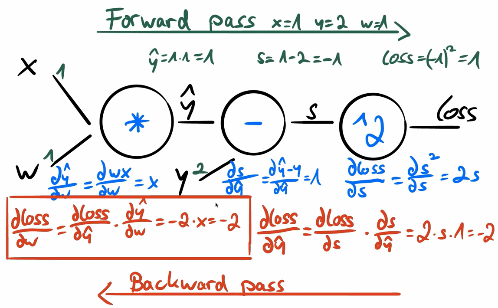


### Topics:
- Chain rule: dz/dx = dz/dy * dy/dx for x -> a(x) -> y -> b(y) -> z
- Computational Graph
- Calculate loss (with y_hat)

<br>

***

<br>
<br>

# Gradient Descent  [^](#table-of-content)
You can find gradient optimization examples in the script `gradient_descent_*.py`.

<br>

### Steps:
1) Prediction: `PyTorch Model`
2) Gradients Computation: `Autograd`
3) Loss Computation: `PyTorch Loss`
4) Parameter updates: `PyTorch Optimizer`


<br>

| Filename | Usecase |
| -------- | ------- |
| `gradient_descent_from_scratch` | everything written from scratch, the weight, the numpy array etc. |
| `gradient_descent_with_torch_gradient` | we replace the numpy arrays with torch tensors. The forward and loss function are still the same, because the same syntax can be used in PyTorch. We also replace the gradient function with a ready-to-use PyTorch function |
| `gradient_descent_with_torch_grad_loss_para` | we replace the remaining manually elements with PyTorch functionality by using the Loss and Optimizer classes from PyTorch |
| `gradient_descent_with_pytorch` | we also replace the Prediction with an PyTorch model, so PyTorch do the complete pipeline for us |
| `gradient_descent_custom_lr_model` | is a little example, how to build a Linear Regression model from scratch as a first introduction how this works for further purpose |

<br>

### Typical Pipeline Steps
1) Design model (input size, output size, forward pass)
2) Construct the loss and optimizers
3) Training loop:
    - forward pass: compute the prediction
    - backward pass: get gradients
    - update weights

<br>

***

<br>
<br>

# Linear Regression  [^](#table-of-content)
### About
In `linear_regression.py` we built a *Linear Regression* with a loaded dataset, completly with **PyTorch**. The result gets plotted with matplotlib in the end.
The following modules are used:

<br>

### Implementation Overview
```bach
model = nn.Linear(input_size, output_size)
criterion = nn.MSELoss()
optimizer = torch.optim.SGD(model.parameters(), lr=0.01)
```

<br>

The output looks like this

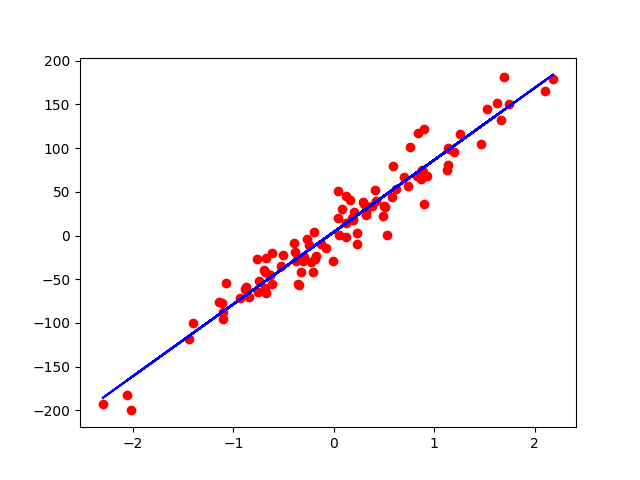

<br>

***

<br>
<br>

# Logistic Regression  [^](#table-of-content)
### About
In `logistic_regression.py` we built a *Logistic Regression* with a loaded dataset, completly with **PyTorch**.

<br>

### Implementation Overview
```bach
model = LogisticRegression()
criterion = nn.BCELoss()
optimizer = torch.optim.SGD(model.parameters(), lr=0.01)
```
<br>


<br>

***

<br>
<br>

# Datasets and Dataloader  [^](#table-of-content)
### About
This section (`datasets_and_dataloader`) is about how to use datasets and how to build your own dataloader class with a specific dataset.

<br>

### Terminology
- *epoch* = 1 forward and backward pass of ALL training samples
- *batch_size* = number of training samples in one forward & backward pass
- *number of iterations* = number of passes, each pass using [batch_size] number of samples
- e.g. 100 samples, batch_size=20 --> 100/20 = 5 iterations for 1 epoch

<br>

### More datasets
```bash
torchvision.datasets.
````

- MNIST()
- fashion-mnist
- cifar
- coco
- ...

<br>

***

<br>
<br>

# Dataset Transforms [^](#table-of-content)
### About
In this section (`dataset_transforms`) we see, how to transform datasets. You can easily transform any kind of data you want, to any kind of data you need

<br>

Important to know is, that such a transform class, always need a `__call__` method which can be used.

<br>

***

<br>
<br>

# Softmax and Cross Entropy [^](#table-of-content)
## Softmax
### Formular of Softmax

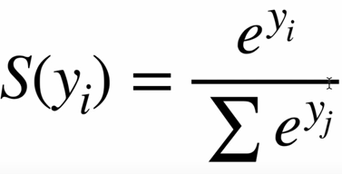

<br>

### Output
The output will be between 0 and 1, so we get ***probabilities*** back.

<br>

### Example

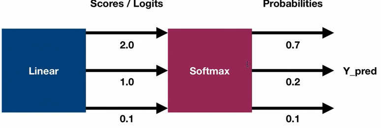

<br>

## Cross-Entropy
### About
The *Cross-Entropy* measures the performance of the classification model and the output is a **probability** between 0 and 1. It can be used in multi-class problems. The loss increases as the predicted probability diverges from the actual label.
> -> The better the prediction, the lower the loss

<br>

### Formular of Cross-Entropy

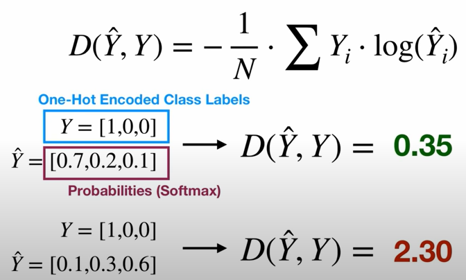

<br>

## nn.CrossEntropyLoss

***Careful!***

nn.CrossentropyLoss applies:
- nn.LogSoftmax
- nn.NLLLoss (negative log likelihood loss)

-> ***NO** Softmax in last layer!*

Y has class label, **not One-Hot!**
Y_pred has raw scores (logits), **no Softmax!**

<br>

## Binaryclass - SIGMOID

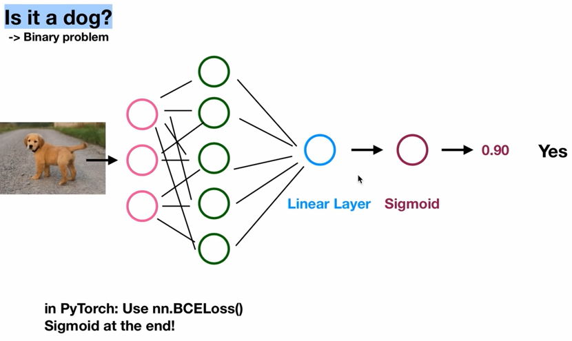

## Multiclass - SOFTMAX

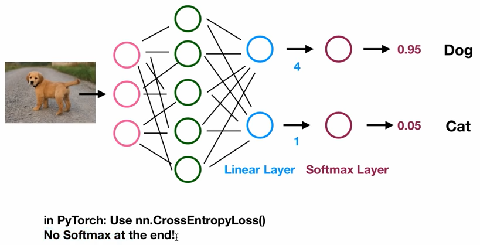

<br>

***

<br>
<br>

# Activation Functions [^](#table-of-content)
AF apply a non-linear transformation and decide whether a neuron should be activated or not.

### Most pupular
- Step functin
- Sigmoid
- TanH
- ReLU
- Leaky ReLU
- Softmax

<br>

### Step function

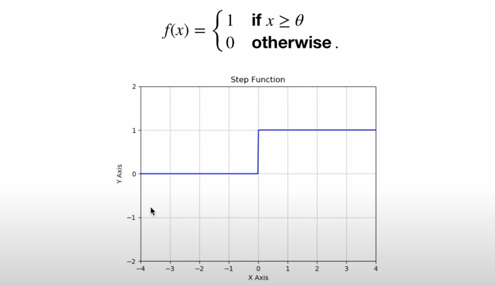

> This is not used in practice

<br>

### Sigmoid function

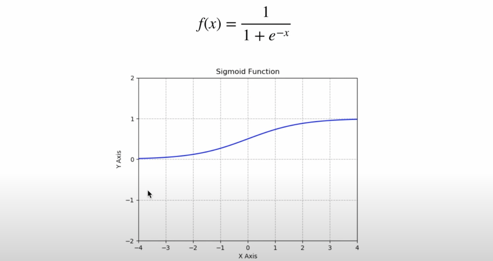

> Typically used in the *last layer* of a **binary classification**

<br>

### TanH function

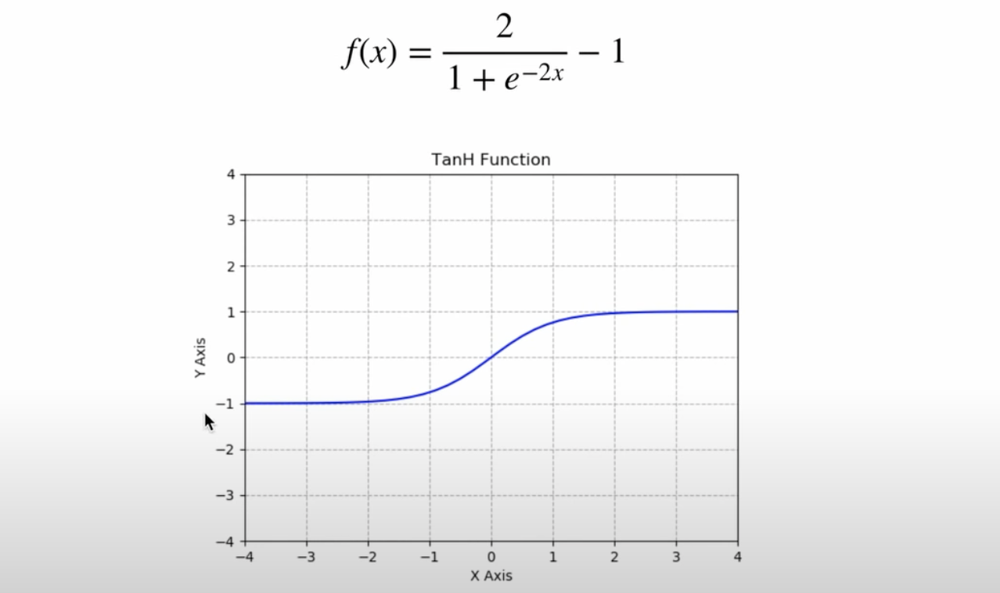

> Hidden layer

<br>

### ReLU function

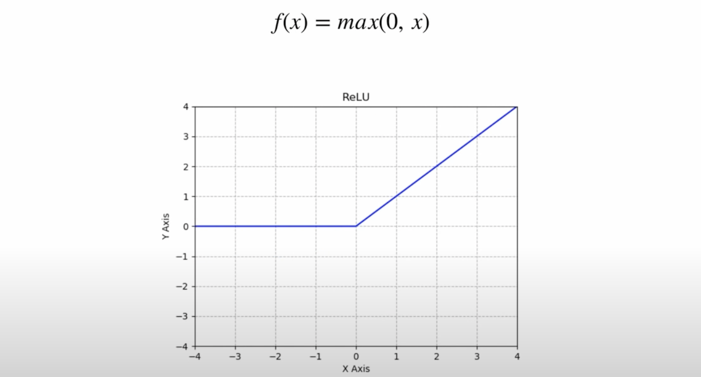

> If you do not know what to use, use ReLU for *hidden layers*

<br>

### Leaky ReLU function

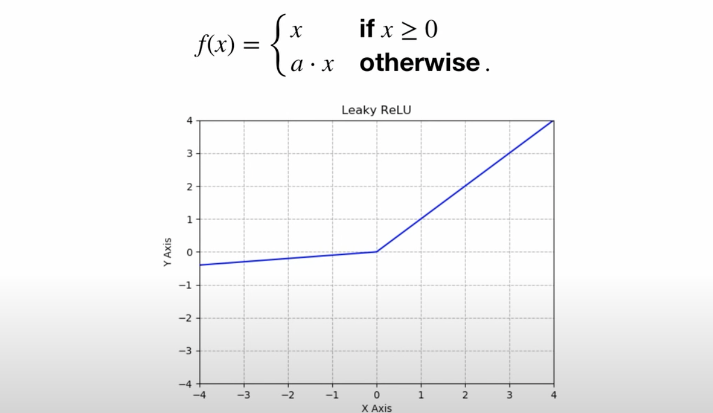

> Imporoved version of *ReLU*. Tries to solve the *vanishing gradient problem*

<br>

### Softmax function

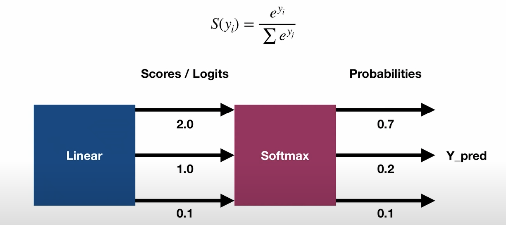

> Good in *last layer* of **multi class classification**

<br>

### How to apply the activation functions

1) Create nn modules
    ```python
    self.linear1 = nn.Linear(input_size, hidden_size)
    self.relu = nn.ReLU()
    ```
2) Use activation function directly in forward pass
    ```python
    out = torch.relu(self.linear1(x))
    ```
    